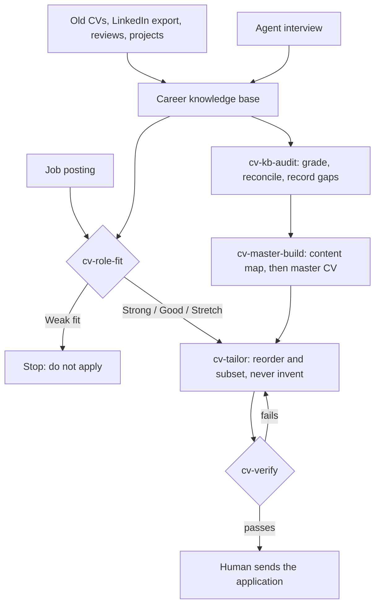
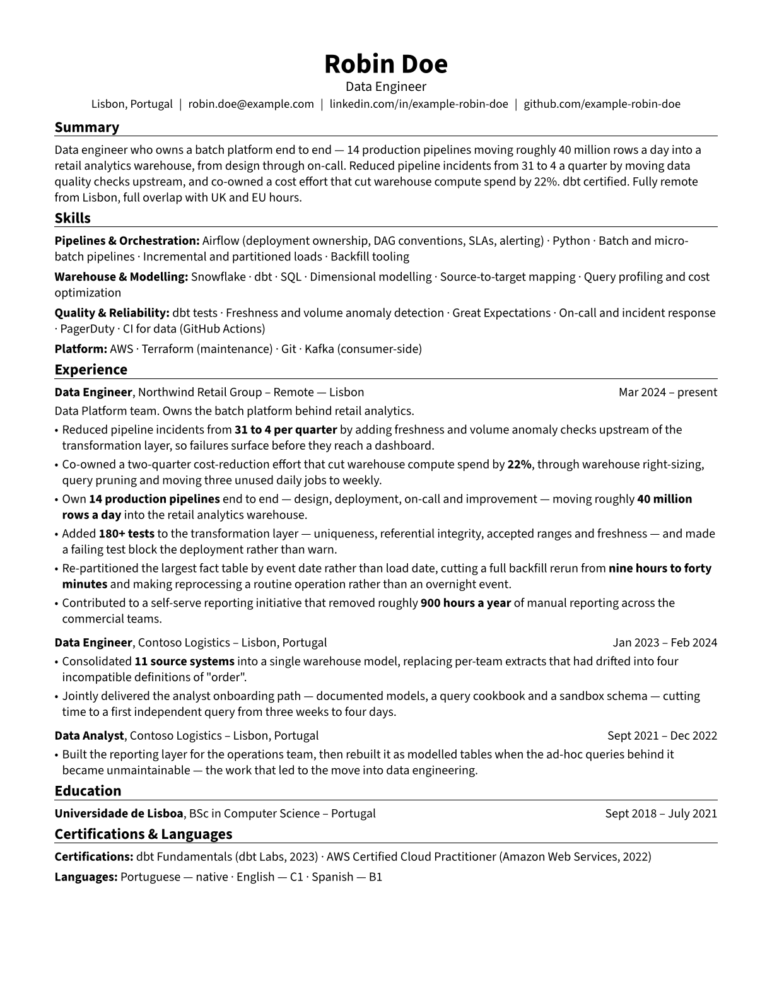

# grounded-cv

[](https://github.com/kevscec/grounded-cv/actions/workflows/ci.yml)
[](LICENSE)

**An evidence-graded framework for AI-assisted CV generation.**

Your AI agent interviews you, builds a knowledge base of your career where every claim is
graded by how verifiable it is, scores real job postings against it, and renders tailored CVs
where every line traces back to a graded claim — with the rules about what you may not claim
enforced by the build, not by memory.

Built on [RenderCV](https://rendercv.com) and the
[Agent Skills](https://agentskills.io) open standard.

---

## What problem this solves

Ask an AI to write your CV and it will write a good one. It will also, quietly, promote things
you *contributed to* into things you *did*, turn a team's numbers into your numbers, and invent
the specifics it does not have. None of that is caught at the writing stage. It is caught in a
technical screen, by which point it has cost you the role.

The failure is structural: **the model has no way to tell what you can defend from what merely
sounds true.** Feeding an AI's confident prose back into another AI compounds it.

`grounded-cv` fixes that by making verifiability a first-class property of every claim.

| Mechanism | What it prevents |
|---|---|
| **Evidence tiers** — every claim graded A/B/C/D by how verifiable it is | Confident prose being treated as fact |
| **Attribution axis** — every metric tagged individual / shared / team | A team's 900 hours becoming *your* 900 hours |
| **Claims register** — contradictions between sources resolved once, in writing | The same overstatement resurfacing in the next document |
| **Gaps file** — unknowns recorded as unknowns | Invented graduation years and job titles |
| **Redline enforcement** — a build step that greps the rendered PDF's text layer | A colleague's name or an internal code name reaching an external document |

## What this is not

- **Not a resume builder.** [RenderCV](https://rendercv.com) does the rendering and publishes
  its own agent skill, which this framework installs alongside and depends on.
- **Not an "AI writes your CV" tool.** Several of those exist and they work. The contribution
  here is the discipline around the writing, not the writing.
- **Not a way to make a thin CV look strong.** It is a way to make a strong CV *survive
  scrutiny* — and, when a role does not fit, to tell you so before you spend an afternoon on it.

## How it works



The important design choice is that the agent does not decide whether a sentence is safe while
it is writing the CV. Two separate things make that decision earlier and later: **tier, source
and attribution travel with the claim** from the moment it is captured, so a CV line inherits
how strong it is allowed to be — and **redlines are checked afterwards**, against the rendered
PDF's text layer, so what must never appear is caught by the build rather than by whoever is
paying attention.

## Requirements

- Python 3.12+ (RenderCV requires it; [`uv`](https://docs.astral.sh/uv/) handles this for you)
- An AI agent that supports Agent Skills — Claude Code, Codex, Cursor, Copilot, VS Code,
  Gemini CLI, OpenCode, Goose and many others
- Optional: `pdftotext` (Poppler) for text-layer verification; the verifier degrades to a
  warning without it

## Quickstart

```bash
npx skills add rendercv/rendercv-skill      # the renderer's own skill
npx skills add kevscec/grounded-cv          # this framework
uv tool install "rendercv[full]" --python 3.13
python -m pip install -r scripts/requirements.txt
python scripts/check_environment.py
```

Then point your agent at the repo and say what you want:

> *"Read AGENTS.md. I want to build my career knowledge base."*

The agent picks up from there. Full walkthrough in [`docs/01-quickstart.md`](docs/01-quickstart.md).

## Your data never enters this repo

Everything personal lives in `workspace/`, which is gitignored, and a pre-commit hook refuses
commits that touch it. See [`docs/06-privacy.md`](docs/06-privacy.md).

## Documentation

| | |
|---|---|
| [Quickstart](docs/01-quickstart.md) | First hour, end to end |
| [The evidence system](docs/02-evidence-system.md) | Tiers and attribution — read this first |
| [The knowledge base](docs/03-knowledge-base.md) | File schema and a tiered adoption path |
| [CV methodology](docs/04-cv-methodology.md) | ATS mechanics, structure, wording, with sources |
| [The workflow](docs/05-workflow.md) | Phases, and which skill runs when |
| [Privacy](docs/06-privacy.md) | What stays on your machine |
| [Sources](docs/07-sources.md) | Every external claim, cited |
| [Framework design notes](docs/08-framework-design.md) | How the repo is structured for public reuse |

## See it working

A fully worked fictional example lives in [`examples/sample-profile/`](examples/sample-profile/)
— a complete knowledge base, a job posting, the fit assessment produced from it, and the CV
that came out the other end.



```bash
python scripts/new_workspace.py --from-example
python scripts/verify.py
```

## License

MIT — see [LICENSE](LICENSE).
