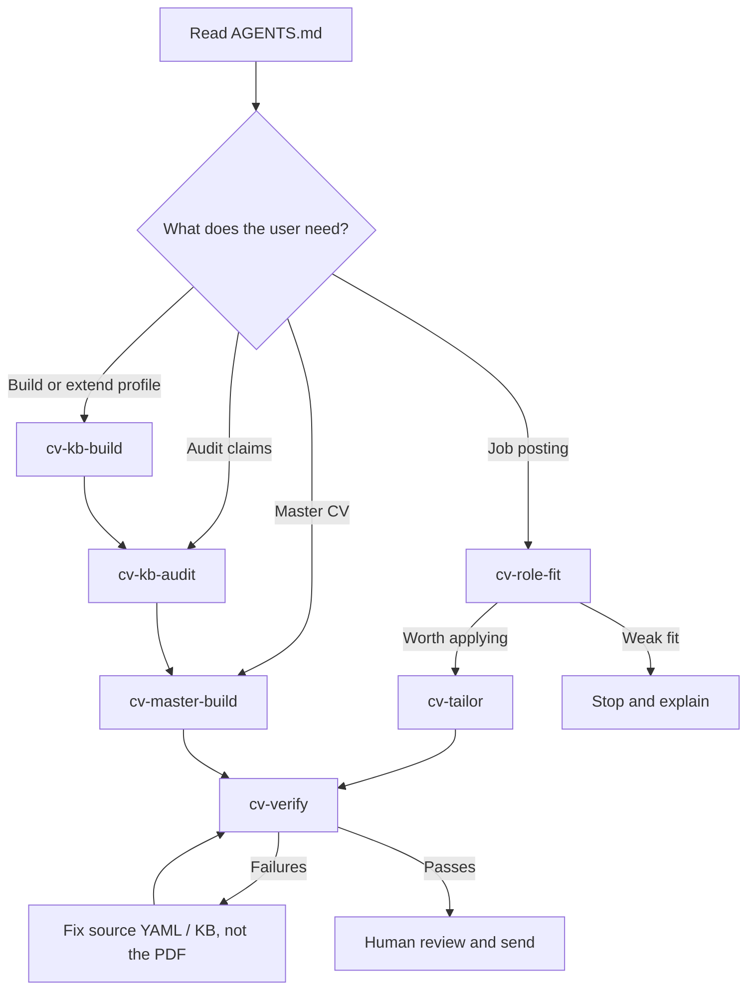

# Framework design notes

This project is meant to be useful to a person and legible to an AI agent. That is why the repo
contains more than prompts: it has skills, templates, examples and checks that make the workflow
repeatable.

## The public surface

| Path | Audience | Purpose |
|---|---|---|
| `README.md` | Humans deciding whether to try it | Explain the point of view, show the loop, link to the worked example |
| `AGENTS.md` | AI agents starting work in the repo | Route the agent to the right skill and state the non-negotiable rules |
| `skills/*/SKILL.md` | Agent skill loaders | Give each phase a bounded procedure and handoff |
| `templates/` | New users | Blank-but-structured starting material |
| `examples/sample-profile/` | New users and contributors | A complete fictional profile that shows what good output looks like |
| `scripts/verify.py` | Users before sending a CV | Enforce the rules machines can check |
| `.github/workflows/ci.yml` | Contributors and maintainers | Prove skills load, the verifier fires, the sample still renders, and the quickstart path still works |
| `scripts/new_workspace.py` | New users | The first command anyone runs; scaffolds `workspace/` from templates or from the sample profile |
| `workspace/` | The user, only | Where their own knowledge base, CVs and applications live. Gitignored — never part of the public repo |
| `.githooks/pre-commit` | Everyone with a clone | Refuses commits that touch `workspace/` or that carry contact details. This is what makes the privacy property structural rather than a request |
| `docs/` | Anyone asking why | The reasoning behind the evidence system, the ATS rules and the sources |

## Why this is a framework, not just a prompt

A prompt can tell an agent not to overstate. A framework can make overstatement harder to ship.
The difference is where the control lives:

1. Claims are captured once in the knowledge base.
2. Each claim gets an evidence tier and each metric gets an attribution.
3. CV lines are selected from that grounded material, not written from memory.
4. Redlines and attribution qualifiers are checked after rendering, against the PDF text layer.
5. The human still sends the application. The system does not automate submission.

That split keeps the repo honest: AI helps with extraction, structure, judgement and drafting,
but the most important safety rules are represented as data and checks.

## Start at five files, not sixteen

The schema has sixteen knowledge-base files, and handing a new user sixteen blank templates is
how they abandon this on day one. The growth path exists so the first session produces something
usable: five core files are already enough to generate a defensible CV.

The path itself is specified in `templates/knowledge-base/README.md` and implemented by
`scripts/new_workspace.py --tier core|recommended|all`. The reasoning is in
[the knowledge base doc](03-knowledge-base.md).

## The agent workflow at a glance

`AGENTS.md` routes an agent with a lookup table, and the README shows how work flows through
the system. This is the third view and the one neither of those gives: what an agent does from
a cold start, including the loop it stays in until the verifier passes.

## What good contributions preserve

A useful change should strengthen one of these properties:

- Traceability: a CV sentence points back to a claim, metric or source.
- Honesty under pressure: a team result cannot become an individual result by wording drift.
- Privacy: personal career data stays in `workspace/`, not in the public repo.
- Reproducibility: examples, templates and checks still work for a new user.
- Portability: plain Markdown and YAML first, so the knowledge base outlives any one tool.
  Rendering is deliberately RenderCV-only for now — the seam exists, a second backend is out of
  scope until it pays for itself.

If a change only makes generated prose sound stronger, it probably belongs outside this repo.

These are the design properties. `CONTRIBUTING.md` says the same thing from the contributor's
side, with the checks a pull request has to pass — keep the two in step if either changes.
