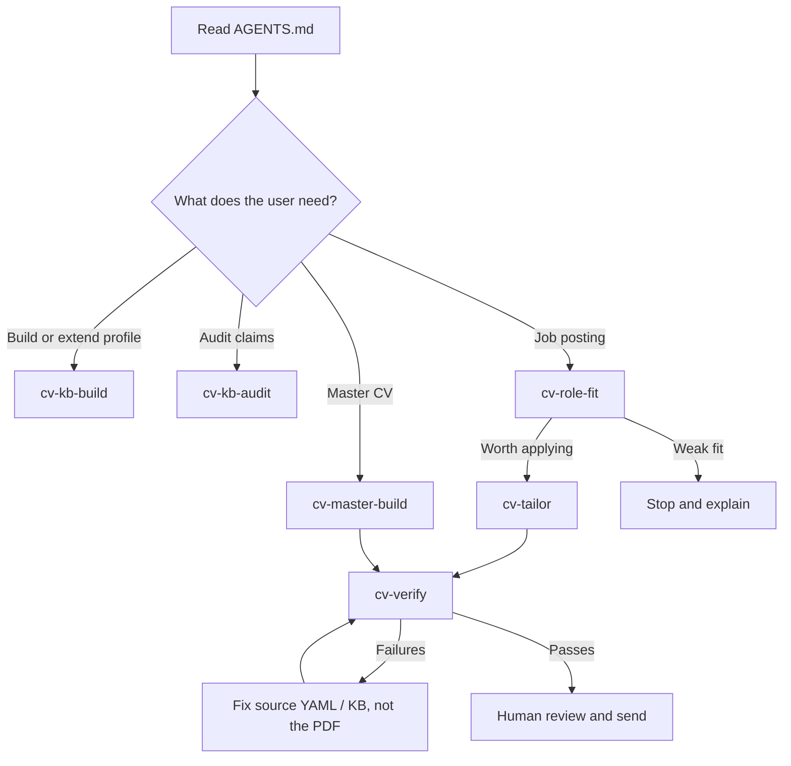

# Framework design notes

This project is meant to be useful to a person and legible to an AI agent. That is why the repo
contains more than prompts: it has skills, templates, examples and checks that make the workflow
repeatable.

## The public surface

| Path | Audience | Purpose |
|---|---|---|
| `README.md` | Humans deciding whether to try it | Explain the point of view, show the loop, link to the worked example |
| `AGENTS.md` | AI agents starting work in the repo | Route the agent to the right skill and state the non-negotiable rules |
| `skills/*/SKILL.md` | Agent skill loaders | Give each phase a bounded procedure and handoff |
| `templates/` | New users | Blank-but-structured starting material |
| `examples/sample-profile/` | New users and contributors | A complete fictional profile that shows what good output looks like |
| `scripts/verify.py` | Users before sending a CV | Enforce the rules machines can check |
| `.github/workflows/ci.yml` | Contributors and maintainers | Prove skills load, the verifier fires, and the sample still renders |

## Why this is a framework, not just a prompt

A prompt can tell an agent not to overstate. A framework can make overstatement harder to ship.
The difference is where the control lives:

1. Claims are captured once in the knowledge base.
2. Each claim gets an evidence tier and each metric gets an attribution.
3. CV lines are selected from that grounded material, not written from memory.
4. Redlines and attribution qualifiers are checked after rendering, against the PDF text layer.
5. The human still sends the application. The system does not automate submission.

That split keeps the repo honest: AI helps with extraction, structure, judgement and drafting,
but the most important safety rules are represented as data and checks.

## The agent workflow at a glance

## What good contributions preserve

A useful change should strengthen one of these properties:

- Traceability: a CV sentence points back to a claim, metric or source.
- Honesty under pressure: a team result cannot become an individual result by wording drift.
- Privacy: personal career data stays in `workspace/`, not in the public repo.
- Reproducibility: examples, templates and checks still work for a new user.
- Portability: plain Markdown/YAML first; tool-specific assumptions stay isolated.

If a change only makes generated prose sound stronger, it probably belongs outside this repo.
